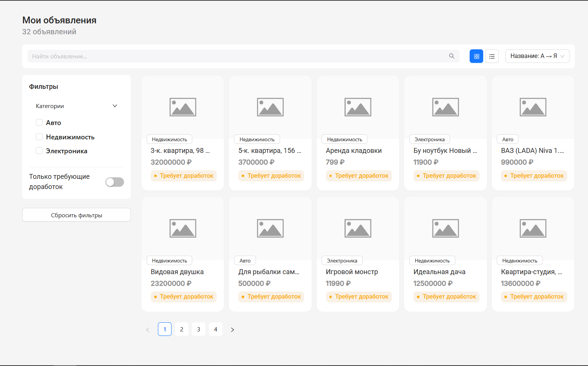
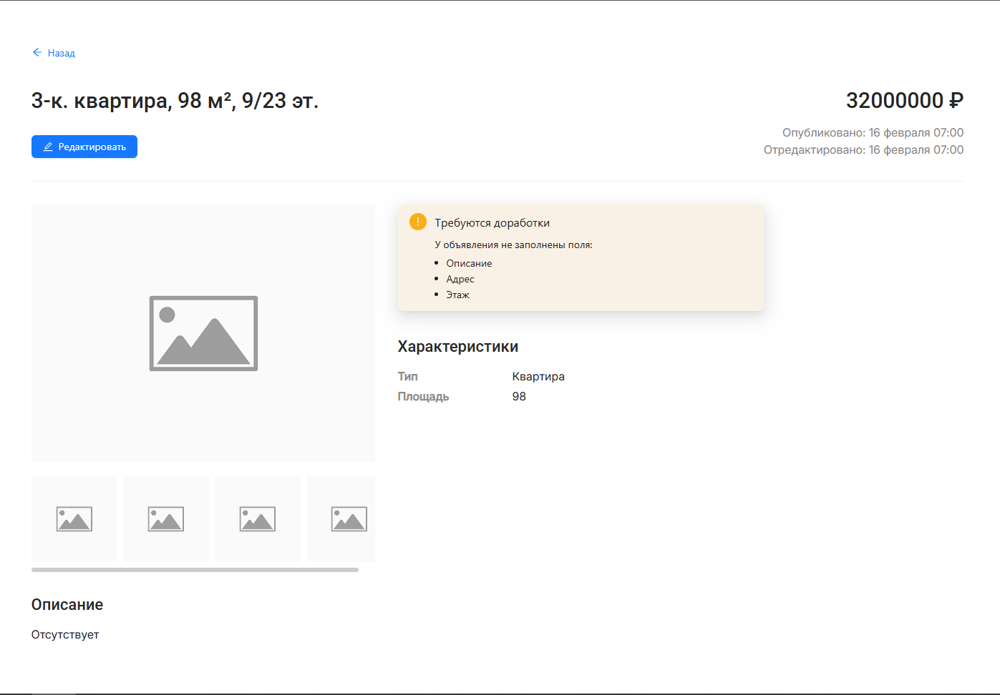
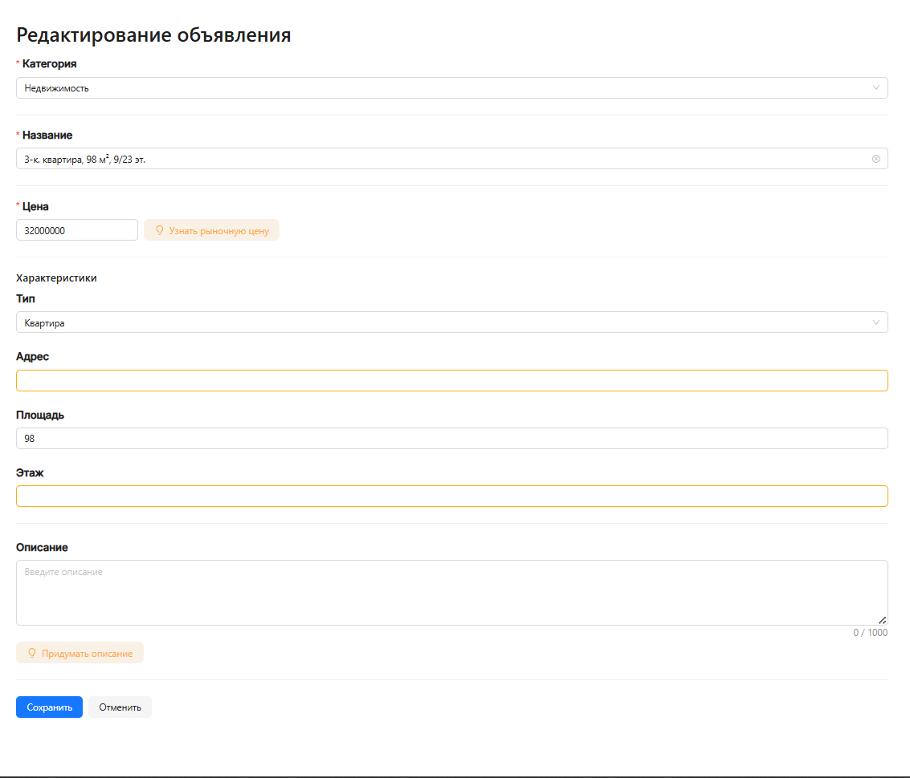

# **Тестовое задание для стажёра Frontend (весенняя волна 2026)**

Нужно разработать веб-приложение — личный кабинет продавца с интегрированным AI-ассистентом, который помогает улучшать описания объявлений. Продавец видит список своих объявлений, выбирает нужное и может просмотреть карточку товара, перейти к редактированию и запросить рекомендации от нейросети. Сервис анализирует содержимое карточки товара и предлагает улучшения текста.

Макеты интерфейса доступны по [ссылке в Figma](https://www.figma.com/design/mkeo1cvzQpEqmN3txeDNBo/%D0%9C%D0%B0%D0%BA%D0%B5%D1%82-%D1%82%D0%B5%D1%81%D1%82%D0%BE%D0%B2%D0%BE%D0%B3%D0%BE-%D0%B7%D0%B0%D0%B4%D0%B0%D0%BD%D0%B8%D1%8F-%D1%81%D1%82%D0%B0%D0%B6%D1%91%D1%80%D0%B0%D0%BC?node-id=16-1388&p=f&t=outUVTh9O2CIiDpq-0).

---

## Скриншоты приложения

 



## Запуск проекта

### 1. Клонирование репозитория
```bash
git clone https://github.com/DmitriyStupin/tech-internship-avito.git
cd REPO_NAME
```

### 2. Установка зависимостей
#### Фронтенд
```bash 
cd client
npm install
```
#### Бэкенд
```bash 
cd server
npm install
```

### 3. Настройка LLM (Ollama)
1. Установите [Ollama](https://ollama.com/)
2. Загрузите модель:
   ```bash
   ollama pull llama3
   ```
3. Убедитесь, что Ollama запущена:
   ```bash
   ollama serve
   ```

### 4. Запуск проекта
#### Фронтенд
```bash 
cd client
npm run dev
```
#### Бэкенд
```bash 
cd server
npm start
```

### 5. Доступ к приложению
#### Фронтенд
http://localhost:5173
#### Бэкенд
http://127.0.0.1:8080

---

## Использованный стек

- react 19.2.4
- typescript 5.9.3
- sass-embedded 1.99.0
- vite 8.0.1
- axios 1.14.0
- zustand 5.0.12
- antd 6.3.5
- react-router-dom 7.13.2
- prettier 3.8.1
- eslint 9.39.4
- node js 22.19.0

---

*Автор: [Ступин Дмитрий Андреевич](https://t.me/dmitrykanst) <3*